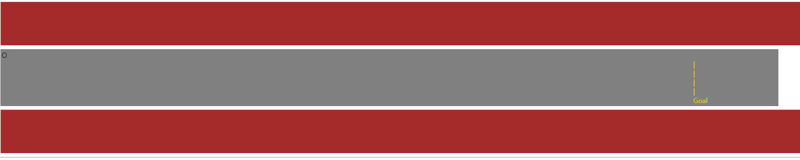
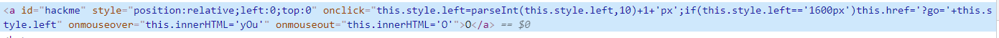
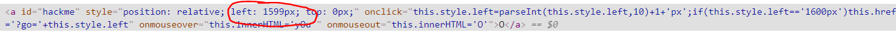

# 10

It's an overkill to write a write up but you might realize that the `O` moves one pixel to the left as you click it, so you need to click all the way to the goal line ...

---

...

---

Is a obviously a joke but you can just change the value on `inspection page` 

After changing left pixel position press the `O` and you pwned it!