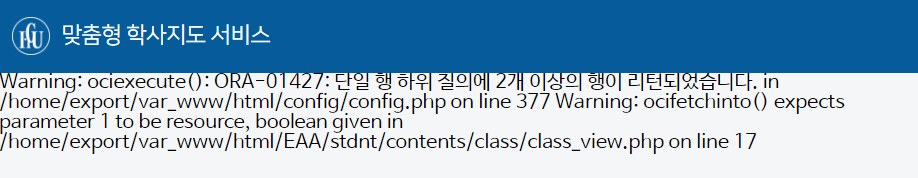
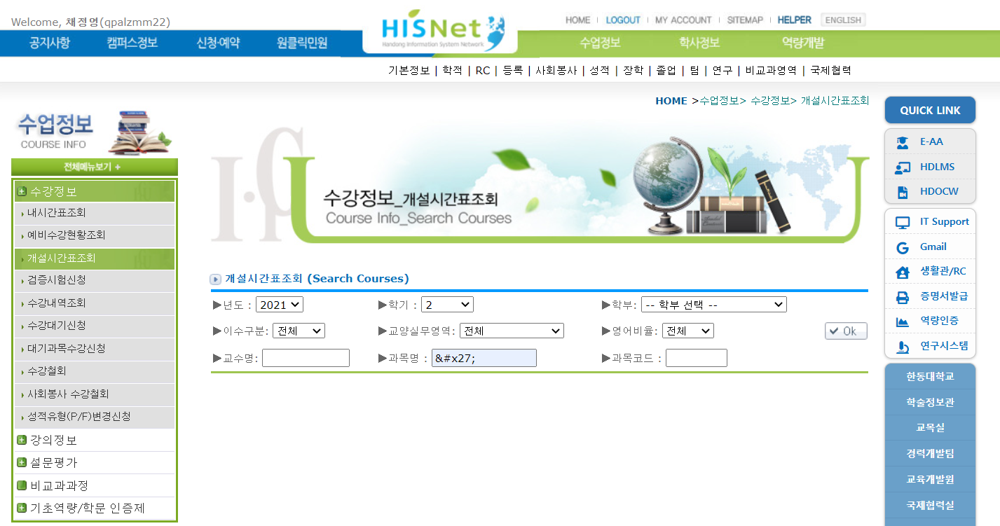
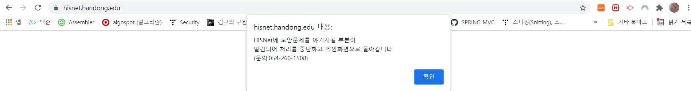

# Hisnet information exposure and SQLi vulnerability Report(Fixed) 

!!! note 
    ※연구 목적이 아닌 악의적인 목적으로 이용할 시 발생할 수 있는

    법적인 책임은 모두 본인에게 있습니다.

    " 정보통신망 이용촉진 및 정보보호 등에 관한 법률"

    정당한 접근권한이 없거나 허용된 접근 권한의 범위를 초과하여 정보통신망에 침하는 행위는 금지한다.(48조 1항)

    위반시 2년 이하의 징역 또는 3,000만원 이하의 벌금에 처한다(64조 1항 1조)

I have been exploring `hisnet` around ever since I found a bug  of exposing db info in `강의 계획서` section.

## Information Exposure

It's hard to visualize without picture(duh) but I don't want to specify where you can find this bug because this bug is not fixed yet, but it looked something like this.

This implies that the system was printing the result of query right back to screen so maybe it's possible for SQLi vulnerability. However, I wanted to approach it as ethically as possible. Also, I'm no professional hacker so I didn't know how to approach... 

I'm no prefessional but I could see that hisnet was using oracle. Also the `ORA-012427` error implies something went wrong in subquery. See [details](https://shxrecord.tistory.com/16) for more.

Since there was an error in bringing data from database, there would be some information missing in the page which implies that `ORA-012427` error cause it. However, since we can see that other information are still viewable, we can say that the server was using more than one SQL statement to gain information. I could also guess that maybe different SQLs are required because there are in different table.

## SQLi (Fixed)

I found similar bug in Hisnet 수강정보. They were returning error staight out to user's screen. Which implies that it's weak against SQLi. Hisnet was using `addslash()` to prevent users from using SQLis. Whenever you type `', ", \`, server would add `\` infront of the input to make them just regular strings in quots.

However, Hisnet did not consider when `'` is encoded to `&#x27;`, which is HTML encoding of `'`. When I passed `&#x27;` as an input, the value of that input form would comeout to be `'`. Using this, you could've done many horrible things to Hisnet db.
If you did something like `1&#x27;;x00 DEXEC sp_MSforeachtable @command1 = &#x27DROP TABLE ?&#x27--`, you would be deleteing all the databases in hisnet andd charged guilty for disrupting public assets.

This is fixed and they would redirect me to homepage if I type any letters like `', ", /` or anything encoding that letters

