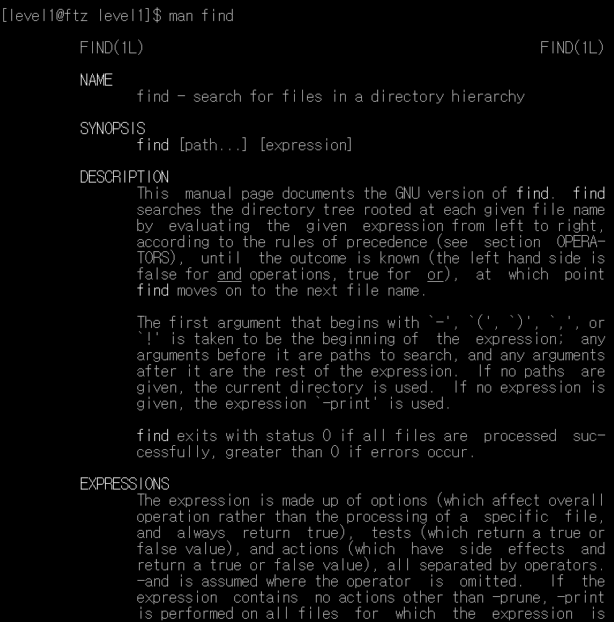
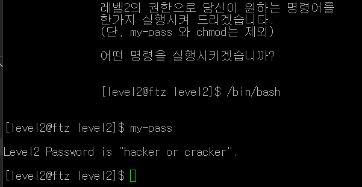

# Level 1

안에 있는 `tmp` 와 `public_html`은 무시해주자 안에 들어가봤자 아무것도 없다.

---

**level1/hint**

---

`linux commands` 들을 열심히 공부했다면 `find` 라는 명령어를 기억할 수 있을 것이다.

`$ man find` 로 우리가 필요한 명령어를 찾아보자.

열심히 읽었다면 우리는 다음과 같이 명령어를 쳐 볼 수 있을것이다

`$ find / -user level2 -perm +400`

다음 명령어는 다음과 같은 뜻을 가진다. `/` Root 디렉토리에서 `-user`소유자가 `level2`이고 `-perm` 권한이 `suid` 걸려있는 파일을 찾아라.

그러면 다음과 같이 결과가 나올 것.

허가 거부된 것들은 전부 그 파일이나 diretory를 읽을 권한이 없어서 뜬 것이다. 잘보면 `/bin/ExecuteMe` 가 매우 수상해보이지 않는가?

`ls -l`로 뭔지 보고 실행해보자.

`level1` 그룹은 읽을 수도, 실행할 수도 있다. 긴말 말고 실행시키자.

---

명령어 하나만 실행가능하다...

당신은 지니가 당신에게 한 가지 소원을 빌라고 하면 어떻게 할 것인가? 당연히 ~~`:(){ :|:& };:`~~ 소원복제 아니겠는가??

`/bin/bash`를 써서 무한한 권한을 얻어보자
이후에 `my-pass`명령어를 써서 flag를 얻자!

