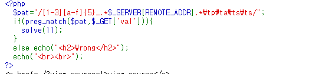
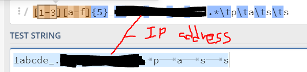
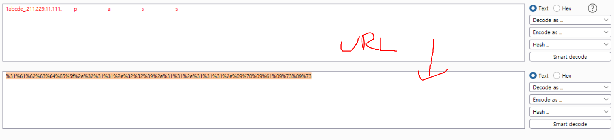
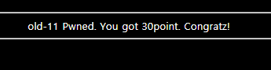

# 11

Hmm... looks like regex problem. Use the link below to find out what regex is and how to match the pattern.

https://ko.wikipedia.org/wiki/%EC%A0%95%EA%B7%9C_%ED%91%9C%ED%98%84%EC%8B%9D

I used [https://regex101.com/](https://regex101.com/). Find more about it. It's a useful site when it comes to regexes.

`?val=1abcde5_(ip_address)    p    a    s    s`

IP address should be of your own ...

> [!TIP]
> use the fact that the site was checking value of `val` and GET method `https://webhacking.kr/challenge/code-2/?val=%31%61%62%63%64%65%5f%2e%32%31%31%2e%32%32%39%2e%31%31%2e%31%31%31%2e%09%70%09%61%09%73%09%73`

**DONE!**

