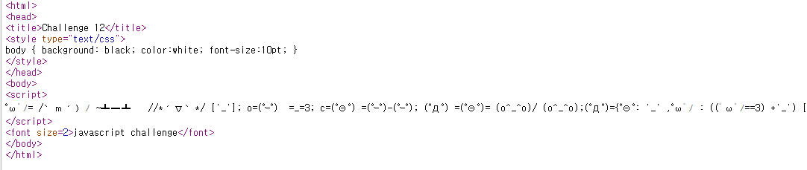
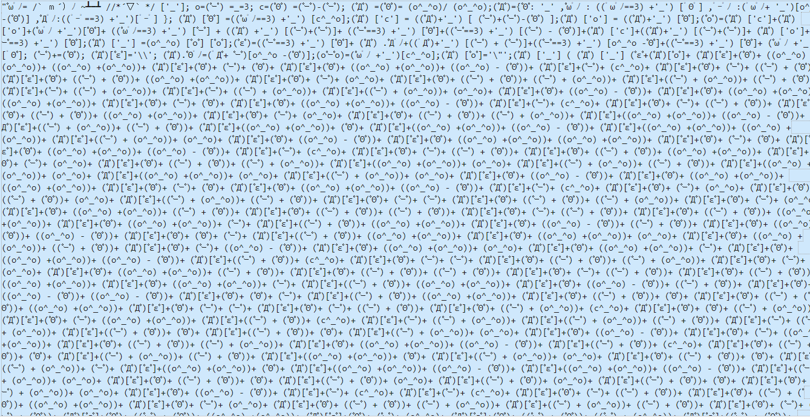
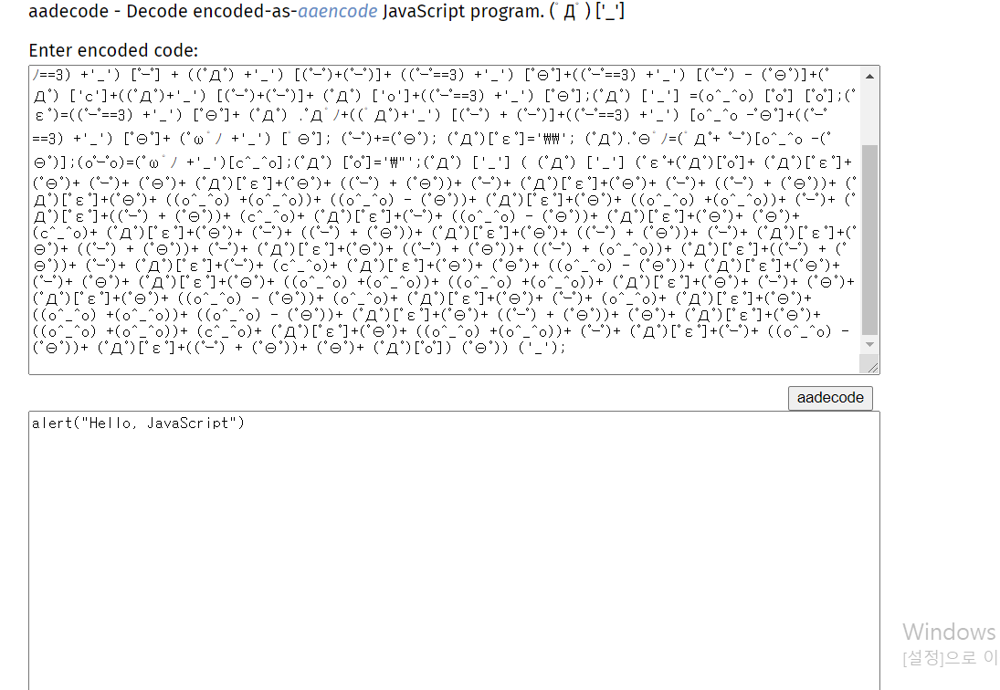
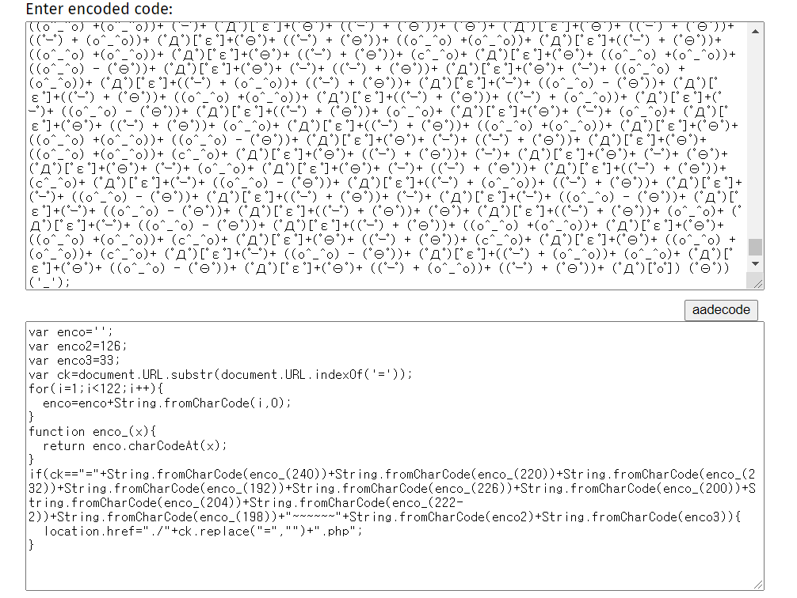
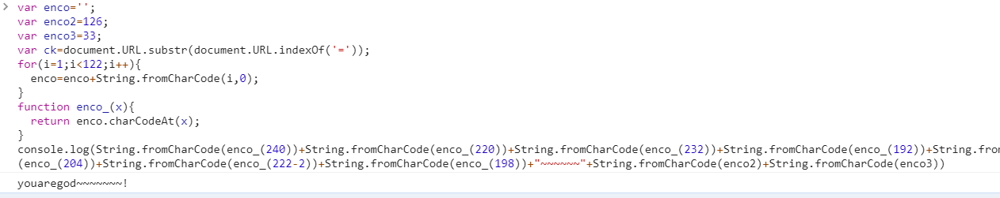
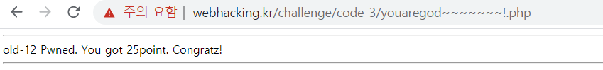

# 12



There are some weird emotes on js script...



There's a lot of them...



I knew it was some sort of obsfucation, so after searching a bit, I found that it's called `aaencode`. Let's decode it. 



```javascript
var enco='';
var enco2=126;
var enco3=33;
var ck=document.URL.substr(document.URL.indexOf('='));
for(i=1;i<122;i++){
  enco=enco+String.fromCharCode(i,0);
}
function enco_(x){
  return enco.charCodeAt(x);
}
if(ck=="="+String.fromCharCode(enco_(240))+String.fromCharCode(enco_(220))+String.fromCharCode(enco_(232))+String.fromCharCode(enco_(192))+String.fromCharCode(enco_(226))+String.fromCharCode(enco_(200))+String.fromCharCode(enco_(204))+String.fromCharCode(enco_(222-2))+String.fromCharCode(enco_(198))+"~~~~~~"+String.fromCharCode(enco2)+String.fromCharCode(enco3)){
  location.href="./"+ck.replace("=","")+".php";
}

```
use inspection paget to get the code....



and **BOOM**




