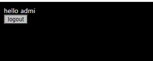
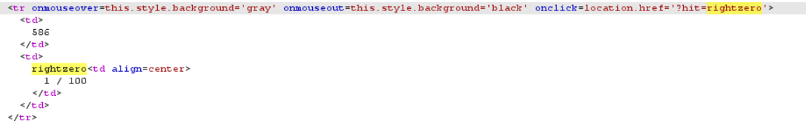
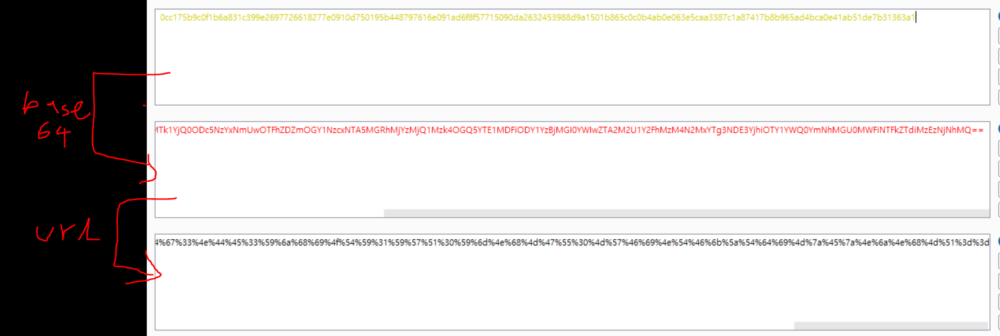
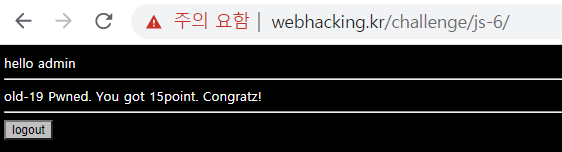

# 19

> [!NOTE]
> **Strategy**
> 
> **1. Realize that the cookie's length increase as input**
>
> **2. Realize that the length of the cookie's id increase by 32(implying that it's decoded by MD5)**
>
> **3. Test out various inputs to check the differences**

**When input = admi**

**When input = a**

    

**Realize that when it's decoded to md5, admi has contains every digits of a**

`url(base64enc(md5(a).md5(d)dmd5(m).md5(i).md5(n)))`// `.` == concatenate 

---

a: 0cc175b9c0f1b6a831c399e269772661

d: 8277e0910d750195b448797616e091ad

m: 6f8f57715090da2632453988d9a1501b

i: 865c0c0b4ab0e063e5caa3387c1a8741

n: 7b8b965ad4bca0e41ab51de7b31363a1

admin: 0cc175b9c0f1b6a831c399e2697726618277e0910d750195b448797616e091ad6f8f57715090da2632453988d9a1501b865c0c0b4ab0e063e5caa3387c1a87417b8b965ad4bca0e41ab51de7b31363a1

---

