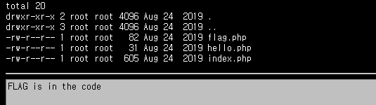
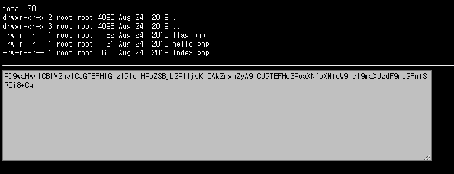
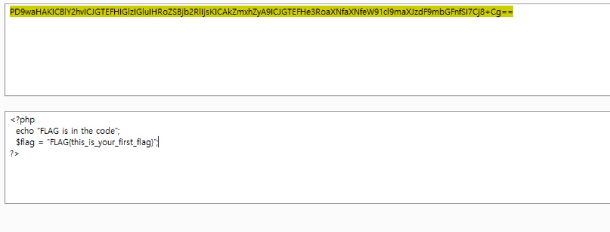

# 25

I found that on url, you can designate which file to open(?). So i tried to open flag.php.

But of course, life is not that easy, it required me to read the flag.php itself. I tried to read it by using quotation marks, echoes etc but couldn't found out why it was not working. After hustle, I decided to see how others did it.

It turned out there is this thing called `php wrapper`.
With it, you can remotly execute files in the system.

just use php://filter with convertion to bast 64 to get all the sources(not the result) and designate the resource to `flag`

`?file=php://filter/convert.base64-encode//resource=flag`

If you convert the following string by base64 decoding, you will get the code below.

Just type that to the `Auth`(in the main menu at `webhacking.kr`) and you are good to go!

