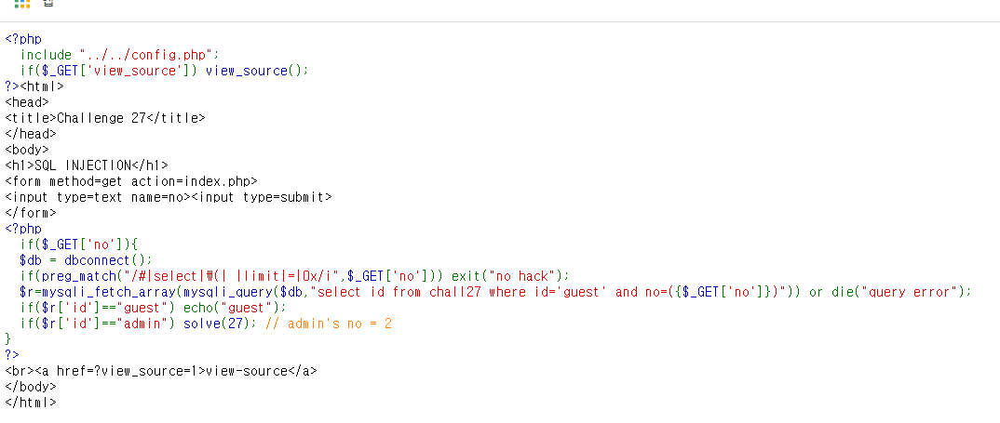
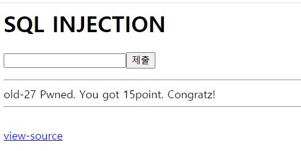

# 27

If you go to `view_source`, you will see following link.

I'm not supposed to use 
(#, select, \(, ' ', limit, =, 0x)

to get rid of closing ), use `;%00` as a null byte injection. Since we want admin whose id = 2 and it to be on top, make first condition false with
`2)` then, follow up by `id like 2` since we can't use `=`.
but for every space, we can't use space charater, imbed tab space instead.

> [!TIP]
> https://webhacking.kr/challenge/web-12/index.php?no=2)%09or%09no%09like%092;%00

