# 33

At first glance problem looked simple and easy. It indeed was, bu takes some time to solve it.

## level 1

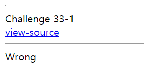

> Page looked like this... let's see the source code.

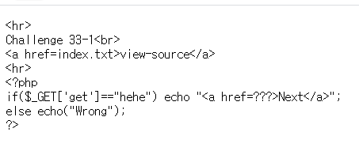

> It's a easy problem. Add the get value of hehe and we are done!

## level 2

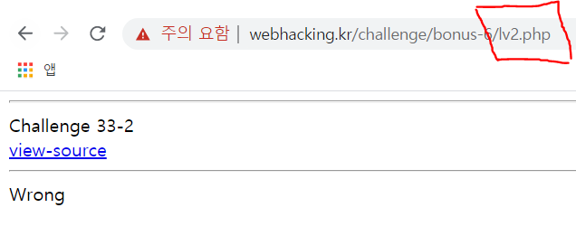

> Let's see the source code.

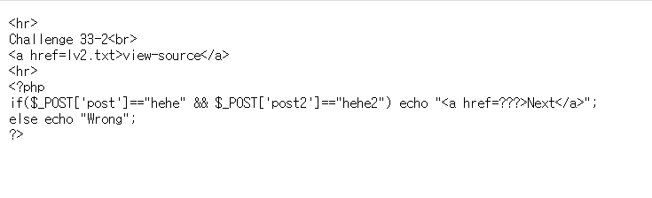

> we need to post values but we don't have form that sends post value... However, there is always a way.

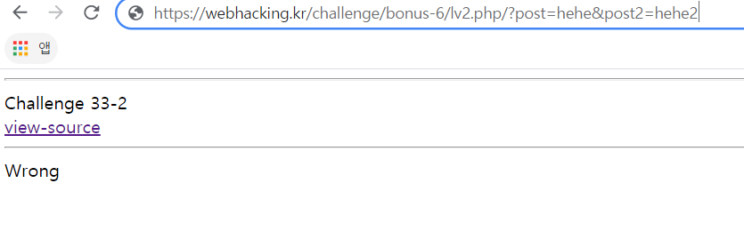

> First, give values by get method.

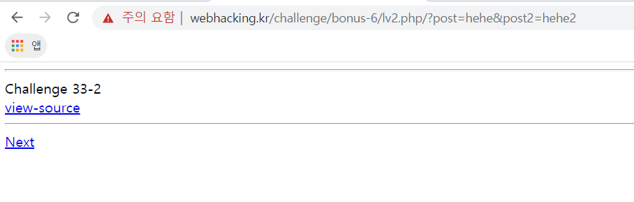

> Then convert it on burp suite

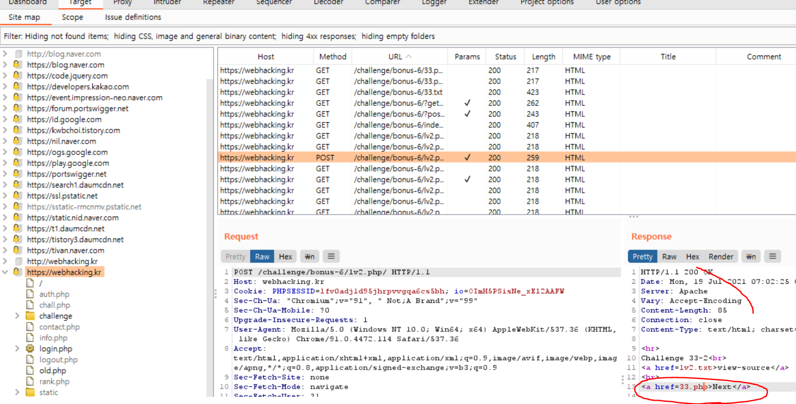

> And forward it. Search google how to convert get values to post values

## level 3

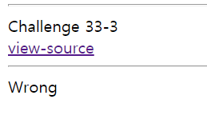

> Let's see the source code.

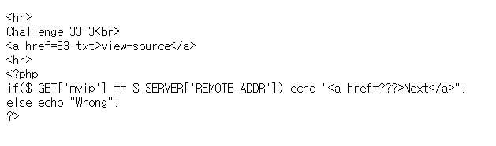

> Easy. `$_SERVER['REMOTE_ADDR']` is just your ip. Search google for your ip and type that on get values.
>> I'm not sure if it's safe for my IP values to be known public... If you are `Good Samaritan` please let me know... 
[issue](github.com/qpalzmm22/qpalzmm22.github.io/pulls)

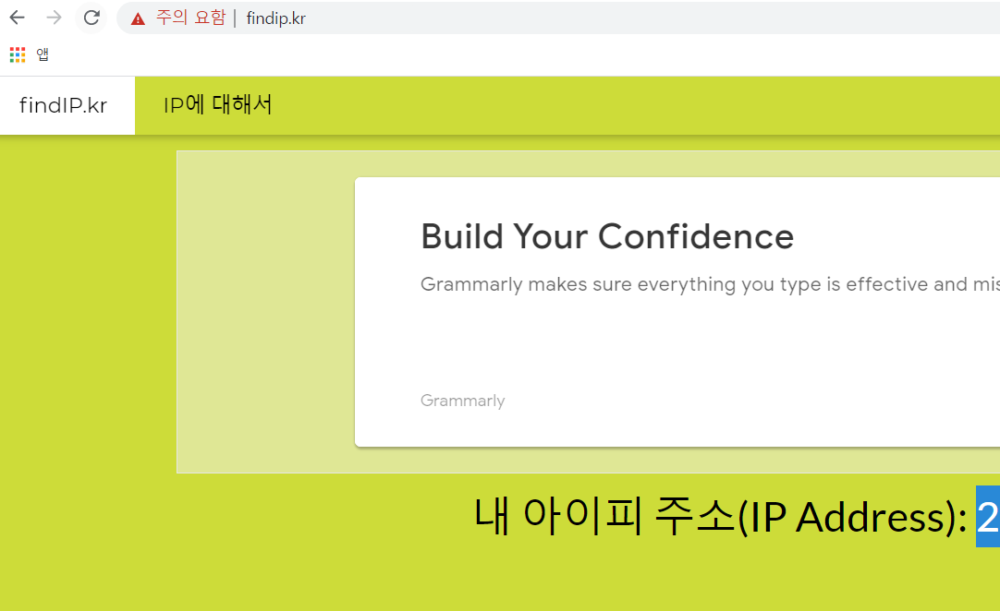

> You can find your ip in this site

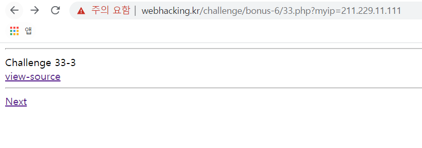

> Done!

## level 4

> For some reason, I skipped level 4... Probably means that it's super easy. You got this!

## level 5

> Let's see this one

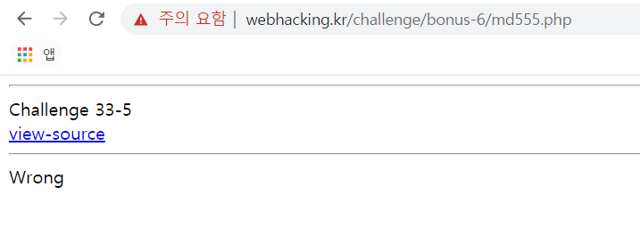

> We need to change post, get, and cookie value. 

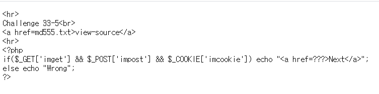

> You can easily do that on burp suite. If you are not using one, please do so.

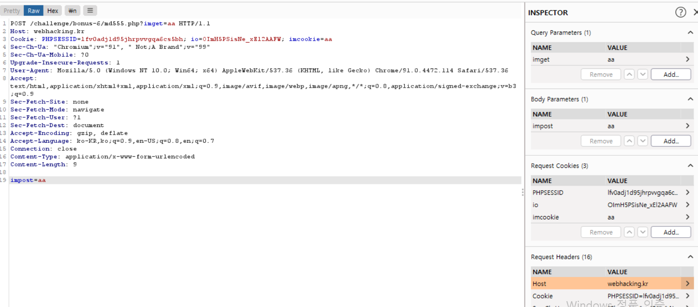

> Done!

## level 6

> I got tired of screen shotting the useless front php page... let's look at the source code.

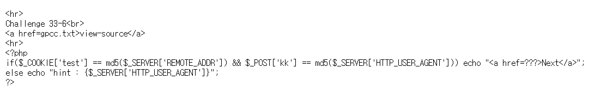

> If you know md5 encoding, it will be super easy for you. Use this ([md5 encoder](https://www.md5hashgenerator.com/)) site to encode the value and put it on the url. 

## level 7

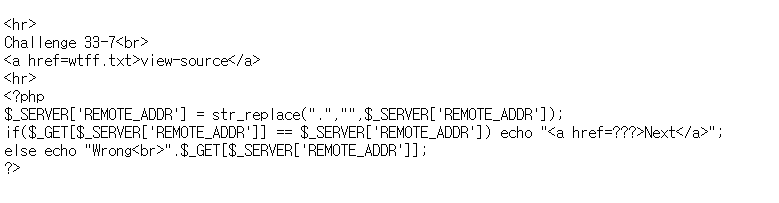

> `str_replace` replaces "." with "" so there's only digits. Write your ip with only digits.

## level 8

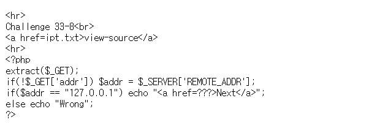

> Pass addr as "127.0.0.1" ... It's easy code reading.

## level 9

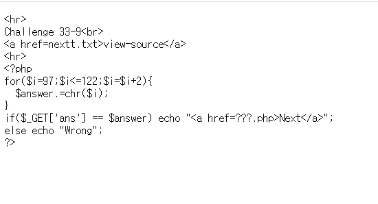

> This php code concatenate from "a" to "z" every other times. I simply created `c` code to solve this.

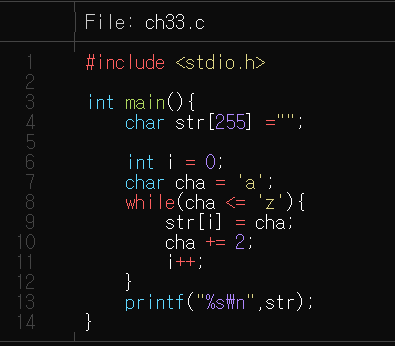

## level 10

> The source code looks nasty, but let's understand what's going on. If you looked closely you can find out that there isn't any post, get or cookie that we can input. Then, let's try to open up what's in `answerip/{$answer}_{$ip}.php`

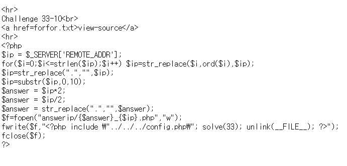

> Remember how I said let's try to understand the code above? um... let's just use the source code and input my ip. There are some meaningless codes so ignore some of them. 

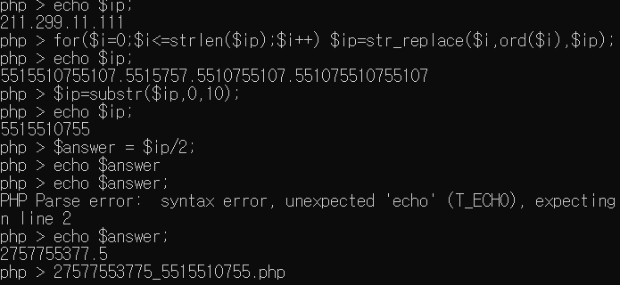

> my answer would be `27577553775_5515510755.php`

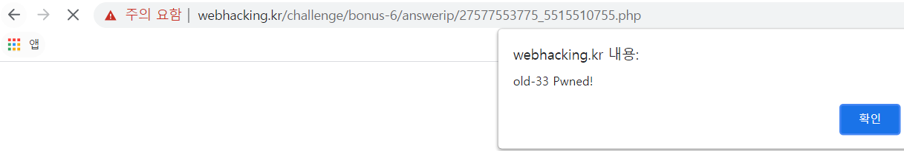

> Oh yeah ~ finally it's done!
