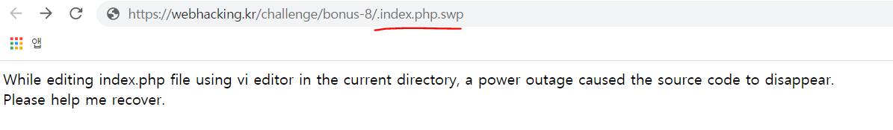
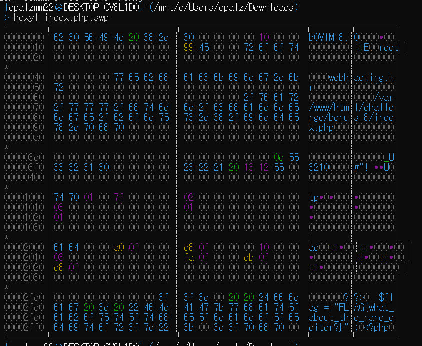

# 36

vi creates backup files. They are names .[filename].swp
I accessed the file like so and opened it with vi but it was all broken...
I `hexyl`ed the file and there was the flag.

 `FLAG{what_about_the_nano_editor?}`