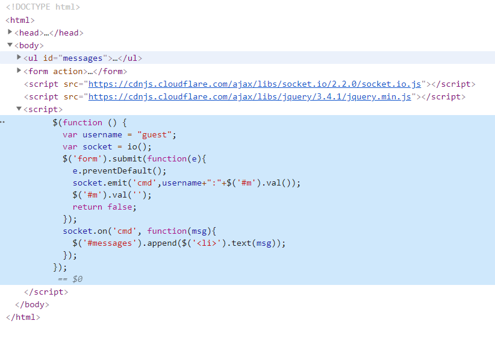
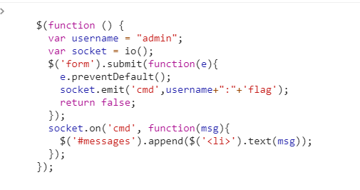
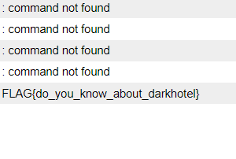

# 58

If you see the source code, you will find some script under script tag. When I erased that on the source code, it still worked suggesting it's a config setting. Therefore we need to change the config and register it on console.

By the way, I found that there are `ls, id, flag help` command avaiable, but flag is only possible with admin authority. 

By changing the username, we can use flag so change it like so.

Then you can see the flag!

