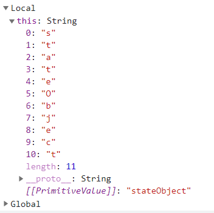
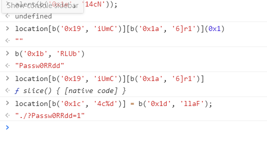

# 34

I was confused and stuck so I got help from google. I saw this `starteObject` and was captivated to start `IIFE`...

That's not how you solve this problem I guess...
If you see this part fo the code, we can find that it's alerting something... but just before that there is else which leads us to somewhere else.

That looks suspicious enought to test that out in console. and the problem is solved just like that.

