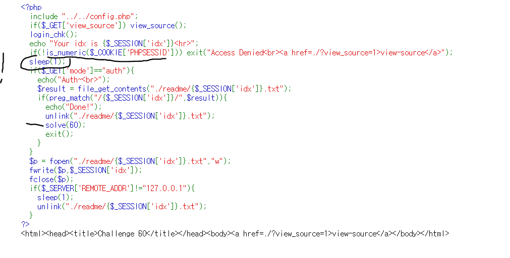
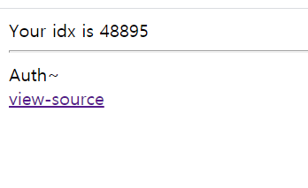
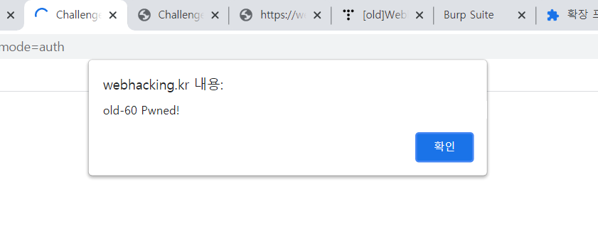

# 60

Let's see the code right away...

We can see that **1. PHPSESSID must be numeric, 2. We need to somehow acess ./readme/{$_SESSION['idx']}.txt before it's erased.**  

First I changed the cookie value by 1 and saw that it created the file and then erose it after a second.

I kept tried to access /readme/48895.txt, yet it didn't work. I searched a bit and realized that they must be in different session for it to work. I thought the different tap is equal to diffrent session. Now I know that session is dependent on browser, so I chose two different browsers (chromium, chrome) to access it. 

now, the file was accessible in different browser.

What we need is not the content of the brower but to invoke `solve(60)` so I acessed same page in different brower in less than a second 

